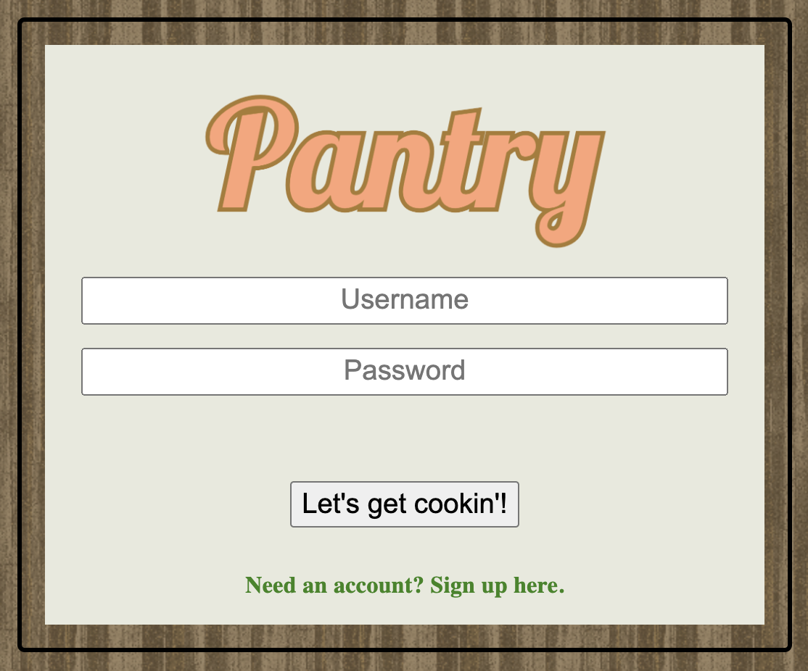
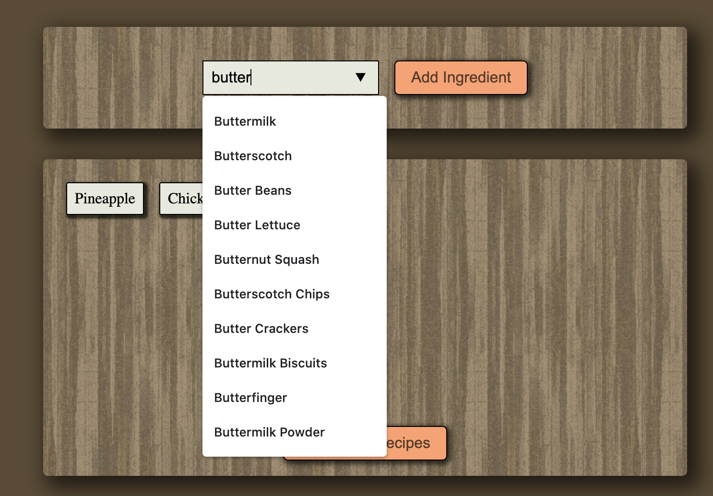
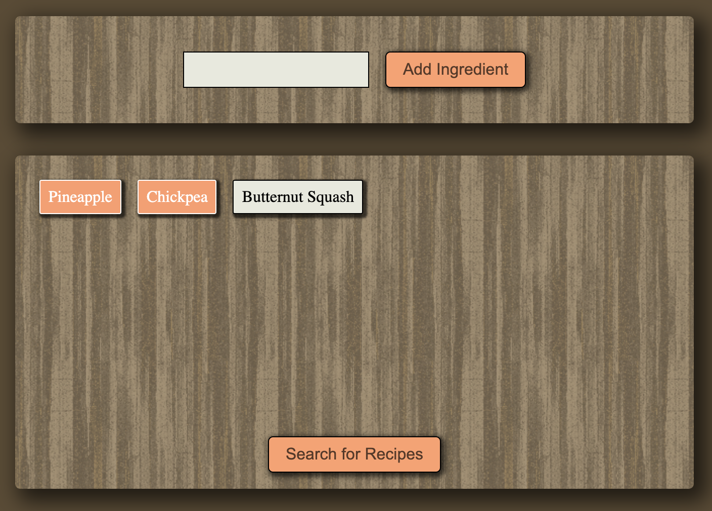
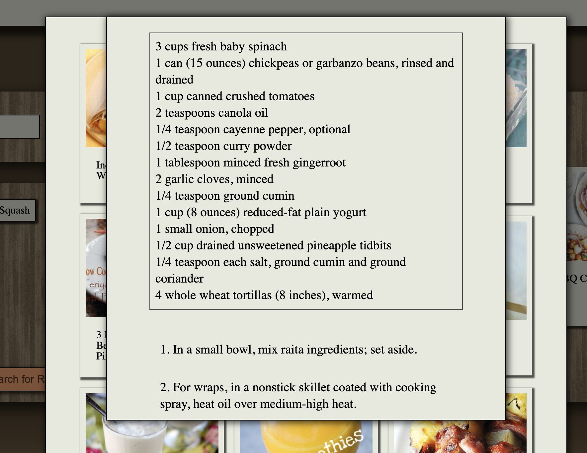

# 5-Dollar-Idea
# The Pantry

## Description

Ever stuck with a bunch of ingredients but not sure what you can cook? Pantry brings recipes from your personal pantry to your fingertips.

## Usage

USER creates username and password to create Pantry app account.

USER types in ingredient to ADD ingredient to their pantry.

USER then select which ingredients he’d like to create a recipe with.

Once select, USER presses “search” button to find recipes from selected ingredients.

## Links

Github repository:
https://github.com/NW-Group-5/5-Dollar-Idea

Deployed Heroku application:
https://pantry-group5.herokuapp.com/

## Prerequisites / Dependencies
* **node**
* **express**
* **express-session**
* **sequelize**
* **passport-local**
* **bcryptjs**
* **requestjs**

## Languages Used
* **HTML**
* **CSS**
* **Javascript**
* **SQL**

## Additional Technology Used
* **Github**
* **Heroku**
* **JawsDB**
* **Spoonacular API**

## Team Members
* **Chris Carlson**
* **Tim Hackel**
* **Danny Tomkins**